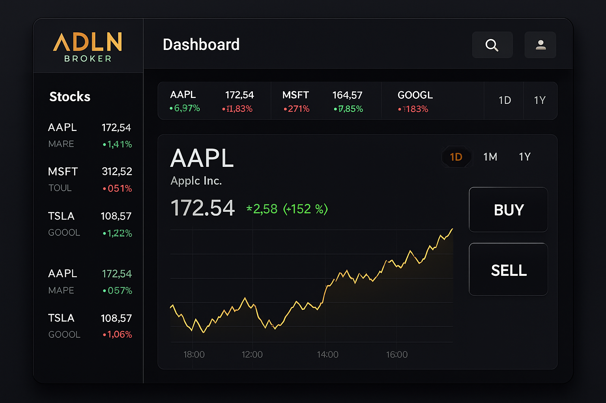

# ADLN Broker


## Plataforma de Investimentos para Testes

Este projeto é um Home Broker simulado, desenvolvido durante as aulas da E2E Treinamentos, com o objetivo principal de servir como uma aplicação para testes de software. Ele simula funcionalidades essenciais de uma plataforma de investimentos, permitindo o cadastro de usuários, login, visualização de um book de ofertas em tempo real (simulado), gerenciamento de carteira, extrato de operações e a realização de ordens de compra e venda.

### Melhorias Implementadas

*   **Logo no cabeçalho:** A imagem da logo foi substituída por `favicon.png` para manter a identidade visual de forma mais concisa.
*   **Modais de Autenticação:** Os botões "Entrar" e "Abra sua Conta" agora abrem modais de login e cadastro, respectivamente, em vez de redirecionar para novas páginas. Os modais são responsivos e centralizados.


### Visão Geral do Projeto

O ADLN Broker foi concebido para ser um ambiente controlado onde estudantes e profissionais de QA podem praticar e aprimorar suas habilidades em testes de aplicações web. A arquitetura simples e as funcionalidades bem definidas o tornam ideal para a criação de cenários de teste, desde testes funcionais e de usabilidade até testes de performance e segurança (com as devidas ressalvas, por ser um ambiente de simulação).

### Squad de Desenvolvimento

Este projeto foi desenvolvido pela seguinte squad:

*   **Alan**
*   **Daniel**
*   **Larissa**
*   **Nilson**

---

## Funcionalidades Principais

*   **Cadastro de Usuários:** Permite a criação de novas contas com validação de dados (CPF, e-mail, senha).
*   **Login e Autenticação:** Sistema de login para acesso seguro à plataforma.
*   **Dashboard do Usuário:** Visão geral do saldo disponível, book de ofertas e carteira de investimentos.
*   **Book de Ofertas (Simulado):** Exibição de ativos com preços e variações em tempo real (dados simulados).
*   **Minha Carteira:** Gerenciamento dos ativos que o usuário possui, com cálculo do valor total da carteira.
*   **Boleta de Compra e Venda:** Interface para envio de ordens de compra e venda de ativos.
*   **Extrato de Operações:** Registro detalhado de todas as transações realizadas pelo usuário.
*   **Book de Ordens:** Acompanhamento do status das ordens enviadas.
*   **Alteração de Senha:** Funcionalidade para que o usuário possa atualizar sua senha.

---

## Como Acessar o Projeto

O projeto está hospedado no GitHub Pages e pode ser acessado diretamente pelo navegador:

[**Acessar ADLN Broker**](https://nilrd.github.io/adlnbroker/)

---

## Configuração para Desenvolvimento e Testes

Para configurar o ambiente localmente e realizar testes ou contribuir com o desenvolvimento, siga os passos abaixo:

### Pré-requisitos

Certifique-se de ter o Git instalado em sua máquina.

### Clonando o Repositório

```bash
git clone https://github.com/nilrd/adlnbroker.git
cd adlnbroker
```

### Executando a Aplicação Localmente

Como este é um projeto front-end puro (HTML, CSS, JavaScript), você pode abri-lo diretamente no seu navegador. Não é necessário um servidor web para a maioria dos testes, mas para simular um ambiente de produção ou para testes que envolvam requisições HTTP (se houver futuras implementações), você pode usar uma extensão de servidor local para navegadores (como o "Live Server" para VS Code) ou um servidor HTTP simples (como o `http-server` do Node.js ou o módulo `http.server` do Python).

**Opção 1: Abrir diretamente no navegador**

Simplesmente abra o arquivo `index.html` no seu navegador preferido:

```bash
# No seu explorador de arquivos, navegue até a pasta 'adlnbroker'
# e clique duas vezes em 'index.html'
```

**Opção 2: Usando um servidor HTTP simples (recomendado para testes mais robustos)**

Se você tem Python instalado:

```bash
python -m http.server 8000
```

Ou se você tem Node.js e `http-server` instalado globalmente:

```bash
npm install -g http-server
http-server
```

Após iniciar o servidor, acesse `http://localhost:8000` (ou a porta indicada) no seu navegador.

---

## Informações para Testes

O ADLN Broker é um excelente playground para testes. Abaixo estão algumas sugestões e informações úteis para começar a testar:

### Cenários de Teste Sugeridos

*   **Testes de Cadastro:**
    *   Cadastro com dados válidos.
    *   Cadastro com CPF já existente.
    *   Cadastro com e-mail já existente.
    *   Cadastro com senhas que não correspondem.
    *   Cadastro com senhas que não atendem aos requisitos (mínimo 8 caracteres, 1 maiúscula, 1 número).
    *   Cadastro com campos vazios.
    *   Validação de formato de CPF e e-mail.

*   **Testes de Login:**
    *   Login com credenciais válidas.
    *   Login com CPF não cadastrado.
    *   Login com senha incorreta.
    *   Login com campos vazios.

*   **Testes de Funcionalidade (Dashboard):**
    *   Verificar se o saldo inicial é de R$ 100.000,00 para novos usuários.
    *   Verificar a exibição correta do book de ofertas (ativos, preços, variações).
    *   Verificar a atualização da carteira após operações de compra/venda.
    *   Navegação entre as abas do book de ofertas (Popular, Ações, Fundos - se implementadas).

*   **Testes de Compra e Venda (Boleta):**
    *   Compra de ativos com saldo suficiente.
    *   Compra de ativos com saldo insuficiente.
    *   Venda de ativos com quantidade disponível na carteira.
    *   Venda de ativos com quantidade insuficiente na carteira.
    *   Venda de ativos que o usuário não possui.
    *   Verificar se a quantidade é múltiplo de 100.
    *   Verificar se quantidade e valor são positivos.
    *   Impacto das operações no saldo e na carteira.
    *   Registro correto das operações no extrato.
    *   Registro correto das ordens no book de ordens.

*   **Testes de Usabilidade:**
    *   Navegação intuitiva entre as páginas.
    *   Responsividade em diferentes tamanhos de tela (desktop, tablet, mobile).
    *   Clareza das mensagens de erro e sucesso.

*   **Testes de Regressão:**
    *   Após qualquer alteração no código, garantir que as funcionalidades existentes continuam funcionando como esperado.

### Dados de Teste

O sistema utiliza o `localStorage` do navegador para persistir os dados de usuários, carteira, extrato e ordens. Isso significa que você pode criar usuários e realizar operações, e esses dados permanecerão no seu navegador até que você os limpe ou faça logout.

*   **Saldo Inicial:** Todo novo usuário cadastrado começa com um saldo de **R$ 100.000,00**.
*   **Ativos Disponíveis (Simulados):** PETR4, VALE3, ITUB4, BBDC4, ABEV3, MGLU3, BBAS3, LREN3.

### Dicas para Testadores

*   **Console do Navegador:** Utilize o console do navegador (F12) para inspecionar elementos, verificar logs (o `sistema.js` possui funções de `debug`), e manipular o `localStorage` para simular diferentes estados de usuário.
*   **Limpeza de Dados:** Para iniciar testes do zero, você pode limpar os dados do `localStorage` do seu navegador (Ferramentas do Desenvolvedor -> Application -> Local Storage).
*   **Simulação de Preços:** Os preços dos ativos no book de ofertas são simulados e variam aleatoriamente para cada atualização, proporcionando um ambiente dinâmico para testes.

---

## Design e Estilo

O ADLN Broker apresenta um design moderno e limpo, com uma paleta de cores que remete ao universo financeiro, utilizando tons escuros como base e detalhes em dourado (amarelo ouro) para destacar elementos importantes e transmitir confiança. A tipografia é clara e legível, garantindo uma boa experiência de usuário.

### Imagens

Aqui está uma prévia do dashboard da plataforma:



### Badges

Em breve, adicionaremos badges de status do projeto aqui!

---

## Contribuição

Contribuições são bem-vindas! Sinta-se à vontade para abrir issues para reportar bugs, sugerir melhorias ou enviar pull requests.

---

## Licença

Este projeto está licenciado sob a licença MIT. Veja o arquivo `LICENSE` para mais detalhes. (Nota: O arquivo LICENSE não está presente no repositório atual, mas é uma boa prática incluí-lo.)

---

## Contato

Para dúvidas ou mais informações, entre em contato com a squad de desenvolvimento. (Informações de contato específicas podem ser adicionadas aqui, se desejado.)


