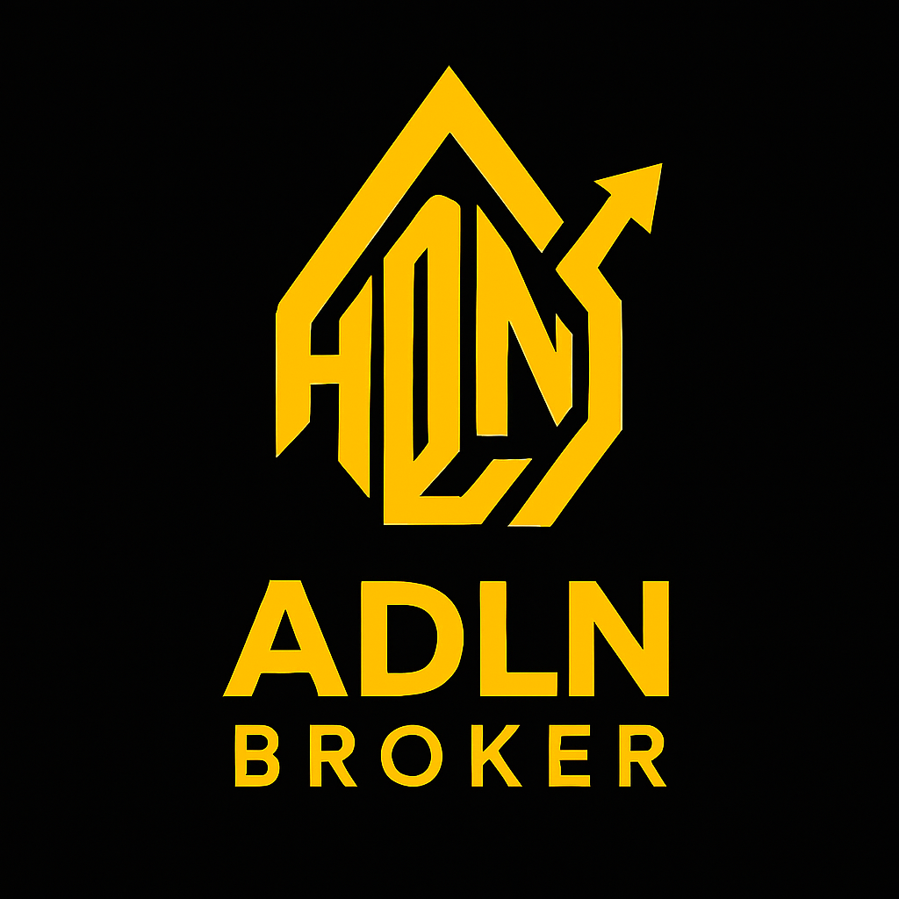

# 🏦 ADLN BROKER - Sistema de Home Broker Simulado

<div align="center">



**Sistema de Home Broker Simulado - Plataforma Completa de Trading**

[](https://github.com/nilrd/adlnbroker)
[](#license)
[](https://github.com/nilrd/adlnbroker)
[](https://github.com/nilrd/adlnbroker)

*Sistema completo de home broker simulado para operações de compra e venda de ativos*

[🚀 **Demo Online**](https://nilrd.github.io/adlnbroker/) | [📖 **Documentação**](REGRAS_NEGOCIO.md) | [🐛 **Reportar Bug**](https://github.com/nilrd/adlnbroker/issues) | [💡 **Solicitar Feature**](https://github.com/nilrd/adlnbroker/issues)

</div>

---

## 📋 Índice

- [🎯 Sobre o Projeto](#-sobre-o-projeto)
- [✨ Funcionalidades](#-funcionalidades)
- [🛠️ Tecnologias](#️-tecnologias)
- [📁 Estrutura do Projeto](#-estrutura-do-projeto)
- [👥 Equipe](#-equipe)
- [🧪 Equipe de QA e Testes](#-equipe-de-qa-e-testes)
- [🎮 Como Usar](#-como-usar)
- [📊 Regras de Negócio](#-regras-de-negócio)
- [🚀 Instalação e Execução](#-instalação-e-execução)
- [📱 Compatibilidade](#-compatibilidade)
- [🔧 Configurações](#-configurações)
- [📈 Roadmap](#-roadmap)
- [🤝 Contribuição](#-contribuição)
- [📄 Licença](#-licença)

---

## 🎯 Sobre o Projeto

O **ADLN BROKER** é uma plataforma completa de home broker simulado desenvolvida em tecnologias web modernas. O sistema permite que usuários realizem operações simuladas de compra e venda de ativos com base em cotações dinâmicas e regras simplificadas da bolsa de valores.

### 🎯 Objetivos

- ✅ **Simular operações reais** de trading em ambiente controlado
- ✅ **Educar usuários** sobre o funcionamento do mercado financeiro
- ✅ **Fornecer interface intuitiva** similar a plataformas profissionais
- ✅ **Implementar regras de negócio** realistas e seguras
- ✅ **Oferecer experiência responsiva** em todos os dispositivos

### 🏆 Diferenciais

- 🔄 **Cotações em tempo real** atualizadas a cada 10 segundos
- 📊 **Gráficos interativos** com múltiplos intervalos
- 💼 **Gestão completa de carteira** e saldo
- 📋 **Book de ordens** com rastreamento completo
- 📈 **Extrato detalhado** de todas as operações
- 📱 **Interface responsiva** para mobile e desktop
- ⏰ **Controle de horário** de funcionamento do mercado

---

## ✨ Funcionalidades

### 🔐 **Autenticação e Segurança**
- [x] Login seguro com CPF e senha
- [x] Validação de dados em tempo real
- [x] Sessões seguras com logout automático
- [x] Proteção contra acesso não autorizado

### 📊 **Dashboard Principal**
- [x] Visão geral da carteira e saldo
- [x] Cotações em tempo real
- [x] Indicadores de mercado
- [x] Status do mercado (aberto/fechado)

### 💰 **Operações de Trading**
- [x] Boleta de compra e venda
- [x] Validação automática de ordens
- [x] Execução baseada em regras de negócio
- [x] Confirmação de operações

### 📈 **Análise e Gráficos**
- [x] Gráficos de candlestick
- [x] Gráficos de linha
- [x] Múltiplos intervalos (1M, 5M, 30M, 1H, 1D)
- [x] Indicadores técnicos básicos

### 📋 **Gestão de Ordens**
- [x] Book de ordens pendentes
- [x] Cancelamento de ordens
- [x] Histórico completo de operações
- [x] Status em tempo real

### 📊 **Relatórios e Exportação**
- [x] Extrato de operações
- [x] Exportação em XLSX
- [x] Exportação em JSON
- [x] Relatórios por período

### 📱 **Interface Responsiva**
- [x] Design adaptativo para mobile
- [x] Navegação otimizada para touch
- [x] Performance otimizada
- [x] Acessibilidade melhorada

---

## 🛠️ Tecnologias

### **Frontend**


### **Bibliotecas**


### **Ferramentas**


### **Deploy**


---

## 📁 Estrutura do Projeto

```
adlnbroker/
├── 📄 Documentação
│   ├── README.md              # Documentação principal
│   └── REGRAS_NEGOCIO.md      # Regras de negócio completas
│
├── 🌐 Páginas Web
│   ├── index.html             # Landing page principal
│   ├── dashboard.html         # Dashboard do sistema
│   └── 404.html              # Página de erro
│
├── 🎨 Estilos CSS
│   ├── style.css             # Estilos gerais
│   ├── landing.css           # Estilos da landing page
│   ├── dashboard.css         # Estilos do dashboard
│   ├── trade-modal.css       # Modal de trading
│   ├── market-info.css       # Informações de mercado
│   ├── menu.css              # Menu de navegação
│   ├── mobile-fixes.css      # Correções mobile
│   └── wallet-modal.css      # Modal da carteira
│
├── ⚡ JavaScript
│   ├── sistema.js            # Sistema principal
│   ├── landing.js            # Funcionalidades da landing page
│   ├── new-chart.js          # Gráficos interativos
│   ├── auth.js               # Autenticação
│   ├── cpf-validation.js     # Validação de CPF
│   ├── mobile-enhancements.js # Melhorias mobile
│   ├── market-info.js        # Informações de mercado
│   └── menu.js               # Funcionalidades do menu
│
├── 🖼️ Recursos Visuais
│   ├── favicon.png           # Ícone do site
│   └── logo.png              # Logo principal
│
└── ⚙️ Configurações
    └── .nojekyll             # Configuração GitHub Pages
```

---

## 👥 Equipe de Desenvolvimento

<div align="center">

### 🚀 **Desenvolvedores**

| Nome | Email | Função |
|------|-------|--------|
| **Nilson Brites** | [nilson.brites@gmail.com](mailto:nilson.brites@gmail.com) | Desenvolvedor Full Stack |
| **Daniel Felix** | [danfelix147@gmail.com](mailto:danfelix147@gmail.com) | Desenvolvedor Frontend |
| **Lary Paula Rocha** | [larypaula.rocha@gmail.com](mailto:larypaula.rocha@gmail.com) | Desenvolvedor Backend |
| **André Santos Pereira** | [asantospereira0@gmail.com](mailto:asantospereira0@gmail.com) | Desenvolvedor Full Stack |

### 📊 **Estatísticas do Projeto**


</div>

---

## 🧪 Equipe de QA e Testes

<div align="center">

### 🔍 **Quality Assurance Engineers**

| Nome | GitHub | Função | Contribuições |
|------|--------|--------|---------------|
| **Alan Santos Pereira** | [@Alansantospereira](https://github.com/Alansantospereira) | QA Lead & Tester | Testes de integração, validação de regras de negócio |
| **Daniel Felix** | [@Daniel-Felix147](https://github.com/Daniel-Felix147) | QA Engineer | Testes de interface, validação de funcionalidades |
| **Larissa** | [@Larissa4645](https://github.com/Larissa4645) | QA Tester | Testes de usabilidade, validação de cenários |
| **Nilson Brites** | [@nilrd](https://github.com/nilrd) | QA & Developer | Testes end-to-end, validação de performance |

### 🎯 **Responsabilidades da Equipe QA**

- ✅ **Testes de Funcionalidade**: Validação de todas as operações de trading
- ✅ **Testes de Interface**: Verificação da responsividade e usabilidade
- ✅ **Testes de Regras de Negócio**: Validação das regras RN-000 a RN-013
- ✅ **Testes de Performance**: Verificação da atualização em tempo real
- ✅ **Testes de Compatibilidade**: Validação em diferentes navegadores
- ✅ **Testes de Segurança**: Verificação da autenticação e sessões
- ✅ **Testes de Integração**: Validação dos gráficos e cotações
- ✅ **Testes de Usabilidade**: Experiência do usuário em diferentes dispositivos

### 🏆 **Agradecimentos Especiais**

> **"A qualidade do ADLN BROKER é resultado do trabalho dedicado e meticuloso da nossa equipe de QA. Cada funcionalidade foi testada extensivamente para garantir uma experiência excepcional aos usuários."**

**- Equipe de Desenvolvimento ADLN**

</div>

---

## 🎮 Como Usar

### 📋 **Passo a Passo**

1. **Acesse o sistema** através do arquivo `index.html`
2. **Crie uma conta** ou faça login se já tiver cadastro
3. **Explore o dashboard** e familiarize-se com a interface
4. **Monitore as cotações** que atualizam automaticamente
5. **Execute operações** de compra e venda
6. **Acompanhe sua carteira** e extrato de operações

### ⚠️ **Importante**

- O sistema funciona apenas em **horário de mercado** (Seg-Sex, 10h-18h)
- Todas as operações são **simuladas** e não envolvem dinheiro real
- As cotações são **geradas automaticamente** para demonstração

---

## 📊 Regras de Negócio

Para informações detalhadas sobre todas as regras de negócio do sistema, consulte o documento completo:

**[📄 REGRAS_NEGOCIO.md](REGRAS_NEGOCIO.md)** - Documento completo com todas as regras de negócio (RN-000 a RN-013)

### 🔍 **Resumo das Principais Regras:**

#### 💰 **Cotação de Ativos**
- ⏰ Atualização automática a cada **10 segundos**
- 📈 Variação de preço: **R$0,01 por ciclo**
- 🎯 Preços simulados para demonstração

#### 📋 **Boleta de Ordens**
- ✅ **Executada**: Valor igual à cotação atual ou diferença ≤ 0.5%
- ⏳ **Aceita (pendente)**: Diferença ≤ 2% da cotação
- ❌ **Rejeitada**: Diferença > 2% da cotação
- 🛡️ **Limite absoluto**: R$ 0,10 a R$ 1.000,00

#### 📦 **Quantidades**
- 📏 Mínimo: **100 unidades** (1 lote)
- 🔢 Múltiplos de 100 obrigatórios

#### ⏰ **Horário de Funcionamento**
- 🏢 Mercado aberto: **Segunda a Sexta, das 10h00 às 18h00**
- 🚫 Fora do horário: Ordens rejeitadas automaticamente

#### 📊 **Gráficos e Timeframes**
- 📈 **Tipos de Gráfico**: Linha e Candlestick (OHLC)
- ⏱️ **Timeframes Disponíveis**:
  - **1M**: 1 minuto (60 pontos)
  - **5M**: 5 minutos (72 pontos)  
  - **30M**: 30 minutos (48 pontos)
  - **1H**: 1 hora (24 pontos)

---

## 🚀 Instalação e Execução

### 📋 **Pré-requisitos**

- Navegador web moderno (Chrome, Firefox, Safari, Edge)
- Conexão com internet (para CDNs)
- Git (opcional, para clonar o repositório)

### 🔧 **Instalação Local**

```bash
# 1. Clone o repositório
git clone https://github.com/nilrd/adlnbroker.git

# 2. Navegue para o diretório
cd adlnbroker

# 3. Abra o arquivo principal
# No Windows:
start index.html

# No macOS:
open index.html

# No Linux:
xdg-open index.html
```

### 🌐 **Execução Online**

1. Acesse o repositório no GitHub
2. Navegue até a aba **"Settings"**
3. Ative o **GitHub Pages**
4. Acesse o link gerado automaticamente

### 🐛 **Solução de Problemas**

| Problema | Solução |
|----------|---------|
| Página não carrega | Verifique se todos os arquivos estão presentes |
| Gráficos não aparecem | Verifique a conexão com internet |
| Login não funciona | Verifique se o cadastro foi realizado corretamente |
| Interface quebrada | Atualize o navegador ou use modo de compatibilidade |

---

## 📱 Compatibilidade

### 🌐 **Navegadores Suportados**

| Navegador | Versão Mínima | Status |
|-----------|---------------|--------|
|  | 90+ | ✅ **Recomendado** |
|  | 88+ | ✅ **Suportado** |
|  | 14+ | ✅ **Suportado** |
|  | 90+ | ✅ **Suportado** |

### 📱 **Dispositivos**

- ✅ **Desktop** (Windows, macOS, Linux)
- ✅ **Tablet** (iPad, Android)
- ✅ **Mobile** (iPhone, Android)
- ✅ **Responsivo** em todas as resoluções

---

## 🔧 Configurações

### 🚀 **GitHub Pages**

O projeto está configurado para deploy automático no GitHub Pages:

```yaml
# .github/workflows/deploy.yml
name: Deploy to GitHub Pages
on:
  push:
    branches: [ main ]
jobs:
  deploy:
    runs-on: ubuntu-latest
    steps:
    - uses: actions/checkout@v3
    - name: Deploy
      uses: peaceiris/actions-gh-pages@v3
      with:
        github_token: ${{ secrets.GITHUB_TOKEN }}
        publish_dir: .
```

### 📊 **Configurações do Sistema**

| Configuração | Valor | Descrição |
|--------------|-------|-----------|
| **Intervalo de Atualização** | 10 segundos | Frequência das cotações |
| **Variação de Preço** | R$ 0,01 | Incremento por ciclo |
| **Horário de Funcionamento** | 10h-18h | Segunda a Sexta |
| **Quantidade Mínima** | 100 unidades | Lote mínimo |
| **Tolerância de Preço** | R$ 5,00 | Diferença aceitável |

---

## 📈 Roadmap

### 🎯 **Versão 1.1** (Próxima)
- [ ] Sistema de notificações push
- [ ] Mais indicadores técnicos
- [ ] Modo escuro/claro
- [ ] PWA (Progressive Web App)

### 🚀 **Versão 1.2** (Futuro)
- [ ] Integração com APIs reais
- [ ] Sistema de alertas de preço
- [ ] Relatórios avançados
- [ ] Multi-idioma

### 🌟 **Versão 2.0** (Longo Prazo)
- [ ] Backend próprio
- [ ] Banco de dados
- [ ] Sistema de usuários real
- [ ] API pública

---

## 🤝 Contribuição

### 📝 **Como Contribuir**

1. **Fork** o projeto
2. **Crie** uma branch para sua feature (`git checkout -b feature/AmazingFeature`)
3. **Commit** suas mudanças (`git commit -m 'Add some AmazingFeature'`)
4. **Push** para a branch (`git push origin feature/AmazingFeature`)
5. **Abra** um Pull Request

### 🐛 **Reportar Bugs**

- Use o template de issue do GitHub
- Inclua screenshots se possível
- Descreva os passos para reproduzir
- Informe o navegador e sistema operacional

### 💡 **Sugerir Features**

- Verifique se já não foi sugerido
- Explique o benefício da feature
- Inclua mockups se possível
- Seja específico sobre a implementação

---

## 📄 Licença

Este projeto está sob a licença **Educacional**. Veja a seção de licença abaixo para mais detalhes.

### 📋 **Termos de Uso**

- ✅ **Uso educacional** permitido
- ✅ **Modificação** permitida
- ✅ **Distribuição** permitida
- ❌ **Uso comercial** não permitido
- ❌ **Responsabilidade** por perdas não assumida

### ⚠️ **Aviso Legal**

Este é um sistema **simulado** para fins educacionais. Não envolve dinheiro real e não deve ser usado para trading real. Os desenvolvedores não se responsabilizam por qualquer perda financeira.

---

<div align="center">

### 🌟 **Apoie o Projeto**

Se este projeto foi útil para você, considere:

[](https://github.com/nilrd/adlnbroker)
[](https://github.com/nilrd/adlnbroker)
[](https://github.com/nilrd/adlnbroker/issues)

---

**Desenvolvido com ❤️ pela Equipe ADLN BROKER**

*Sistema de Home Broker Simulado v1.0*

[⬆️ Voltar ao Topo](#-adln-broker---sistema-de-home-broker-simulado)

</div>
